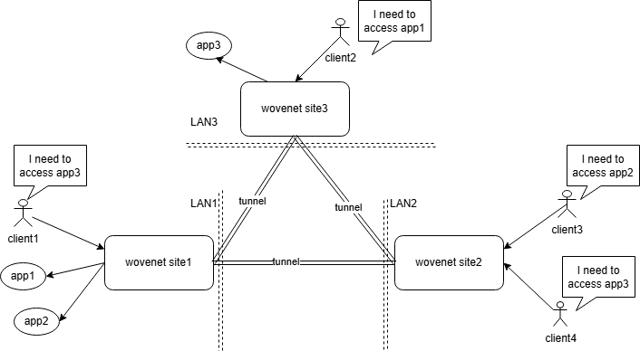

# wovenet

[![Release][1]][2] [![MIT licensed][3]][4]

[1]: https://img.shields.io/github/v/release/kungze/wovenet?color=orange
[2]: https://github.com/kungze/wovenet/releases/latest
[3]: https://img.shields.io/github/license/kungze/wovenet
[4]: LICENSE

[简体中文](./README_zh.md)

An application-layer VPN that connects separate private networks, builds a mesh network, and improves network stability, security, and traffic performance.

At first glance, `wovenet` is a site-to-site VPN project, similar to solutions like [IPSec VPN](https://en.wikipedia.org/wiki/IPsec) and [wireguard](https://www.wireguard.com/) etc. However, a key difference is that [IPSec VPN](https://en.wikipedia.org/wiki/IPsec) and [wireguard](https://www.wireguard.com/) are typical VPNs based on Layer 3 (L3) packet encapsulation, while `wovenet` directly encapsulates application-layer data. Therefore, `wovenet` can be considered an **application-layer VPN**.

Compared to these traditional VPNs, `wovenet` has two major advantages:

* `wovenet` tunnels transmit application-layer data directly, avoiding extra packet headers, resulting in higher bandwidth utilization;
* `wovenet` enables application-level access control, allowing fine-grained control over which applications at a site can be accessed by other sites.

`wovenet` enables users to access services located at remote sites (typically within a LAN) through local socket connections. As illustrated above, in LAN1 there is an application, app1, which under normal circumstances can only be accessed by users within LAN1. However, users in LAN3 also want to access app1. The solution is simple: by deploying `wovenet` in both LANs with proper configuration, wovenet in LAN3 will open a local socket port. Users in LAN3 can then access app1 in LAN1 through the socket port provided by their local `wovenet`. instance.

## Examples

Here are some examples demonstrating various `wovenet` use cases, intended to help readers quickly evaluate whether `wovenet` is worth exploring further. **P.S.:** I believe the list below is far from exhaustive. If you discover new use cases, please consider sharing them with other readers and the project authors.

If you encounter unclear configuration options while walking through these examples, please refer to [config.yaml](./config.yaml).

* [Release Public IP from VPS to Reduce Public Cloud Costs](./examples/release-public-ip/README.md)
* [Implement NAT traversal with wovenet](./examples/reverse-proxy/README.md)
* [Improve network performance with wovenet](./examples/network-preformance/README.md)
* [An effective solution for systems that involve a large number of dynamic ports (such as: VDI Platform)](./examples/multiple-port/README.md)
* [Converting Unix Socket applications to TCP Socket applications](./examples/convert-unix-to-tcp/README.md)

Before running these examples, you need to download the latest version of `wovenet` from the [release](https://github.com/kungze/wovenet/releases) page and extract it.

## TODO LIST

* Add RESTful API to support dynamic app configuration
* Develop a web UI to simplify configuration
* Establish tunnels using hole punching to eliminate reliance on public IPs
* Add traffic monitoring functionality
* Supports establishing a tunnel using the STCP protocol, thereby enabling support for the TCP protocol (QUIC is based on UDP)
