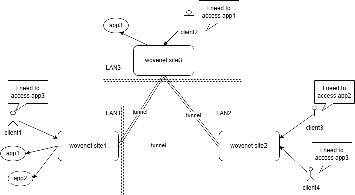

# wovenet

[![Release][1]][2] [![MIT licensed][3]][4]

[1]: https://img.shields.io/github/v/release/kungze/wovenet?color=orange
[2]: https://github.com/kungze/wovenet/releases/latest
[3]: https://img.shields.io/github/license/kungze/wovenet
[4]: LICENSE

[English](./README.md)

应用层网络 VPN，它可以连接不同的私有局域网， 构建多站点的 mesh 网络，提升网络带宽，增强网络稳定性，安全性。

直观来看，`wovenet` 就是一个 site-to-site VPN 项目，与 [IPSec VPN](https://en.wikipedia.org/wiki/IPsec)，[wireguard](https://www.wireguard.com/) 类似。这其中一个核心的差异：[IPSec VPN](https://en.wikipedia.org/wiki/IPsec)，[wireguard](https://www.wireguard.com/) 这些通用 VPN 一般是基于三层报文的封装实现，可以称为 L3 layer VPN，而 `wovenet` 是直接封装应用层数据，因此 `wovenet` 可以被成为 **应用层 VPN** （application layer VPN）。相比于这些通用 VPN，`wovenet` 有两大优势：

* `wovenet` 隧道内直接传输应用层数据，不涉及额外包头封装，带宽利用率更高；
* `wovenet` 可以做到应用级别的访问控制，可以控制本站点内哪些应用可以被其他站点访问；

`wovenet` 可以使用户通过本地站点内的套接字访问远端站点的服务（通常位于局域网内）。如上图：在局域网 LAN1 存在 app1， 正常情况下它只能被 LAN1 内的用户访问。但现在，在局域网 LAN3 有用户也想访问 app1。解决方案：只需只需要在两个局域网都启动 `wovenet`（做好正确的配置），在 LAN3 `wovenet` 会打开一个套接字端口，LAN3 的用户就可以通过本局域网内 `wovenet` 打开的套接字端口访问到位于 LAN1 的 APP1。

#### `wovenet` 其他优势

* **自动发现：** 通过配置相同的 `crypto.key`，`messageChannel.mqtt.topic` 和不同的 `siteName`，各站点自动感知到其他站点并相互建立隧道。
* **隧道高可用** 一个隧道可以由多个 `dataChannel` 组成，多个 `dataChannel` 构成了负载均衡，任意 `dataChannel` 的中断不会导致整个隧道的中断。
* **自动恢复** 如果 `dataChannel` 意外中断，`wovenet` 会不断尝试重新创建，不需要手动干预。
* **自动获取公网 IP** `wovenet` 可以自动获取本站点的公网 IP。公网 IP 的变化不会要求配置文件的变动。
* **强大的抗丢包能力** `wovenet` 默认的隧道传输协议是 [QUIC](https://baike.baidu.com/item/%E5%BF%AB%E9%80%9FUDP%E7%BD%91%E7%BB%9C%E8%BF%9E%E6%8E%A5/22785443)， QUIC 具有非常优秀的重传算法和拥塞控制算法，在不健康的网络环境中会极大的提升网络传输性能。

## 示例

下面是一些示例，展示 `wovenet` 的各种应用场景，希望能通过这些示例快速启发读者，快速确定 `wovenet` 是否值得进一步的研究。**PS：** 我相信下面示例列表绝非 `wovenet` 的全部应用场景，如果各位读者有新的灵感，希望您能向其他读者和作者分享。

在使用过程中有不懂的配置项，请查阅[config.yaml](./config.yaml)

* [释放 VPS 的公网 IP，减少公有云花费](./examples/release-public-ip/README_zh.md)
* [借助 wovenet 实现内网穿透](./examples/reverse-proxy/README_zh.md)
* [借助 wovenet 提升网络传输性能](./examples/network-preformance/README_zh.md)
* [借助 wovenet 应对存在大量动态变化的端口的系统（如：VDI 系统）](./examples/multiple-port/README_zh.md)
* [unix socket 应用转为 tcp socket 应用](./examples/convert-unix-to-tcp/README_zh.md)

在运行这些示例之前，需要先从 [release](https://github.com/kungze/wovenet/releases) 下载最新版本 `wovenet`，并解压。

## 概念解释

* **site：**  一个 `wovenet` 服务代表一个站点，一个站点代表一个私有网络。`wovenet` 可以作为该站点连接其他站点的出口（隧道入口），也可以作为其他站点连接该站点的入口（隧道出口）。
* **messageChannel：** 第三方的数据交换服务，目前仅支持 MQTT。各站点通过 messageChannel 感知对方，并交换基本信息，以便相互建立隧道。在 messageChannel 中传输的数据会被配置文件中配置的 `crypto.key` 加密，所以你可以放心使用任意第三方的 MQTT 服务，即使该服务不支持 ssl 加密传输。
* **tunnel（隧道）：** 连接两个站点的通道，通道经过 ssl 加密。它是由一个或多个 dataChannel 组成。
* **tunnel local socket：** `wovenet` 在本地打开的套接字，其他站点通过连接到这个套接字创建出 dataChannel。
* **dataChannel：** 一个 dataChannel 封装了一个 QUIC connection 或者 SCTP connection（还未实现），一个 dataChannel 可以打开多个 stream。
* **local exposed app：** 本地站点向其他站点暴露的 app，其他站点只能访问本地站点配置的 localExposedApps。
* **remote app：** 对应远端站点的 **local exposed app**
* **remote app local socket：** `wovenet` 为远端访问站点的 app 在本地打开的套接字，向该套接字发送的数据会通过隧道转发到远端站点对应的 app。
* **stream：** 在隧道中打开的一个数据流，用于转发 app 客户端与 app 服务端之间的数据。可以是一个 QUIC stream 或 SCTP stream（还未实现）。stream 中的第一个数据是一个握手数据包，用于告诉 app server 端的 `wovenet` 该 stream 是为哪个 app 打开的。
* **client connection：** app client 连接到 **remote app local socket** 打开的一个 connection。
* **app connection：** `wovenet` 打开的一个通向 app server 的 connection。

## 后续功能规划

* 增加 restful 接口，支持动态配置 app
* 增加一套 web ui，降低配置复杂度
* 实现通过打洞的方式建立隧道，摆脱对公网 IP 的依赖
* 增加流量监控功能
* 实现通过 sctp 协议建立隧道，进而增加对 TCP 协议的支持（QUIC 是基于 UDP 的）
