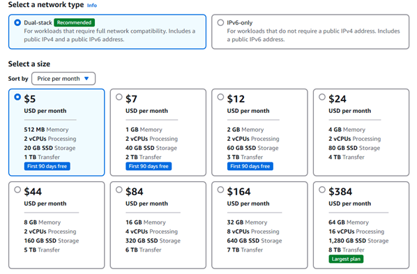
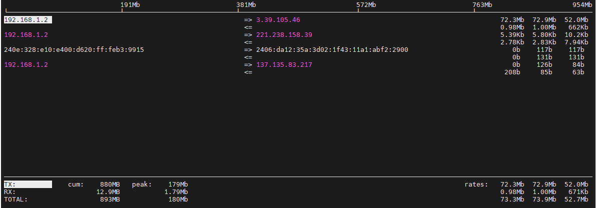
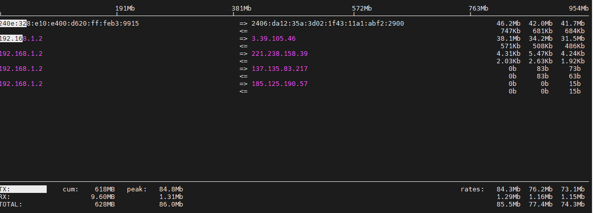

# Release Public IP from VPS to Reduce Public Cloud Costs

[简体中文](./README_zh.md)

## Background

Many readers may have experience deploying their own applications on public cloud VPS instances. To access services hosted on a public cloud VPS from a local machine, the VPS must have a public IP address, especially an IPv4 address.

[AWS Lightsail](https://aws.amazon.com/lightsail/) is a very cost-effective VPS product. However, due to the new [pricing policy for public IPv4 addresses](https://aws.amazon.com/cn/blogs/aws/new-aws-public-ipv4-address-charge-public-ip-insights/), the cost of using Lightsail has significantly increased.

* Lightsail with public IPv4 address

 

* Lightsail without public IPv4 address


## Solution

With the help of `wovenet`, we can eliminate the dependency on public IP addresses (the public cloud VPS does not need to configure a public IPv4 address).

**Note:**

* Not configuring a public IPv4 address on AWS Lightsail does not mean it cannot access the IPv4 network. AWS will assign a private IPv4 address to the instance, which can access IPv4 networks via NAT.
* Although the cloud VPS no longer needs a public IP, the client side must have at least one public IPv4 address or access to an IPv6 address. (If you are using home broadband, both are generally available for free upon request from your ISP; if you are using an educational network, IPv6 access is usually available by default.)
* In this example, `wovenet` will create two tunnels: one IPv4 connection (AWS to local) and one IPv6 connection (local to AWS). Both are full-duplex, forming a load-balanced, highly available network.

This article will use the iperf application (a Linux bandwidth testing tool) as an example to demonstrate how to configure `wovenet`, enabling local access to applications on a public cloud VPS even without a public IPv4 address.

### Environment Info

| Host Location | Public IPv4 Address | Public IPv6 Address |
|---------|-----------|-----------|
| AWS     |  3.39.105.46 | 2406:da12:35a:3d02:1f43:11a1:abf2:2900 |
| 本地  | 36.106.107.114 | 240e:328:e10:e400:d620:ff:feb3:9915 |


**Note:**

* The AWS IPv4 address is only used for comparison and testing purposes. In the final setup, AWS does not need a public IPv4 address, and it will not be referenced in the `wovenet` configuration file below.

### AWS Host Configuration

Create a `config.yaml` file with the following content:

```yaml
siteName: aws

crypto:
  # This key is used to encrypt sensitive information.
  # Each wovenet instance must use the same key.
  # WARNING: Do not use the key provided in this example to avoid potential leaks.
  key: "aA6wBHTYd%#dOPr8"

logger:
  level: DEBUG
  file: ""
  format: json

messageChannel:
  protocol: mqtt
  mqtt:
    brokerServer: mqtt://mqtt.eclipseprojects.io:1883
    # WARNING: Strongly recommend modifying the topic.
    # Wovenet instances sharing the same topic will form a mesh network.
    topic: "kungze/wovenet/dual-stack-ui78Tydwq"

# If your local network cannot access IPv6, you don't need to configure this section.
tunnel:
  localSockets:
  # The public IPv6 address is exclusively assigned to this host and configured directly on the host NIC,
  # so the dedicated-address mode is used here.
  - mode: dedicated-address
    transportProtocol: quic
    publicAddress: 2406:da12:35a:3d02:1f43:11a1:abf2:2900
    publicPort: 25890

localExposedApps:
- appSocket: tcp:127.0.0.1:5201
  appName: iperf
```

**Note:**

* We don't use Public IPv4 address here.
* You must add a firewall/security group rule on the public cloud platform to allow UDP port 25890.

Start `wovenet` with:

```
./wovenet run --config ./config.yaml
```

Start the iperf server with:

```
iperf3 -s
-----------------------------------------------------------
Server listening on 5201 (test #1)
-----------------------------------------------------------
```

### Local Host Configuration

Create a `config.yaml` file with the following content:

```yaml
siteName: local

crypto:
  # This key is used to encrypt sensitive information.
  # Each wovenet instance must configure the same value.
  # WARNING: Do not use the key provided in this example, otherwise sensitive information may be leaked.
  key: "aA6wBHTYd%#dOPr8"

logger:
  level: DEBUG
  file: ""
  format: json

messageChannel:
  protocol: mqtt
  mqtt:
    brokerServer: mqtt://mqtt.eclipseprojects.io:1883
    # WARNING: It is strongly recommended to modify the topic.
    # Wovenet instances sharing the same topic will form a mesh network.
    topic: "kungze/wovenet/dual-stack-ui78Tydwq"

# If you cannot control your local public IP address, this section is not needed
# (but your local network must be able to access IPv6 in that case).
tunnel:
  localSockets:
  # Locally, the public IPv4 address is often assigned to a NAT gateway or modem.
  # You must configure a port forwarding rule there
  # (mapping an external public port to an internal local port)
  # so that the wovenet instance can be directly accessed from the public network.
  - mode: port-forwarding
    publicPort: 36092
    listenPort: 26098
    # In some cases, especially home networks, the public IP may not be static.
    # Here, automatic public IP detection is configured to prevent VPN tunnel failures
    # due to public IP changes.
    publicAddress: autoHttpDetect
    httpDetector:
      url: https://ipinfo.io/ip
    transportProtocol: quic

remoteApps:
- siteName: aws
  appName: iperf
  localSocket: tcp:127.0.0.1:5201
```

**Note:**

On the local side, the public IPv4 address is set on the NAT gateway or modem/router. You’ll need to set up port forwarding (external port: 36092, internal port: 26098, protocol: UDP).

Start `wovenet` with:

```
./wovenet run --config ./config.yaml
```

**Important Notes:**

* It is strongly recommended to modify `crypto.Key` and `messageChannel.mqtt.topic`, and never expose these values in a public environment. If exposed, malicious users might connect to your site network and potentially launch attacks.

### Validation Results

Verify that `wovenet` is functioning using iperf, and observe network interface traffic using `iftop`.

#### Test with AWS public IPv4 address directly:

```
$ iperf3 -c 3.39.105.46 -P 10 -t 60
Connecting to host 3.39.105.46, port 5201
[  5] local 192.168.1.2 port 39652 connected to 3.39.105.46 port 5201
[  7] local 192.168.1.2 port 39662 connected to 3.39.105.46 port 5201
[  9] local 192.168.1.2 port 40948 connected to 3.39.105.46 port 5201
[ 11] local 192.168.1.2 port 40958 connected to 3.39.105.46 port 5201
[ 13] local 192.168.1.2 port 40974 connected to 3.39.105.46 port 5201
[ 15] local 192.168.1.2 port 40978 connected to 3.39.105.46 port 5201
[ 17] local 192.168.1.2 port 40986 connected to 3.39.105.46 port 5201
[ 19] local 192.168.1.2 port 40994 connected to 3.39.105.46 port 5201
[ 21] local 192.168.1.2 port 41008 connected to 3.39.105.46 port 5201
[ 23] local 192.168.1.2 port 41020 connected to 3.39.105.46 port 5201

......

[SUM]   0.00-60.01  sec   567 MBytes  79.2 Mbits/sec  21082             sender
[SUM]   0.00-60.09  sec   540 MBytes  75.4 Mbits/sec                  receiver
```



As shown above, traffic only used the IPv4 address.

#### Test with AWS public IPv6 address directly:

```
$ iperf3 -c 2406:da12:35a:3d02:1f43:11a1:abf2:2900 -P 10 -t 60
Connecting to host 2406:da12:35a:3d02:1f43:11a1:abf2:2900, port 5201
[  5] local 240e:328:e10:e400:d620:ff:feb3:9915 port 47640 connected to 2406:da12:35a:3d02:1f43:11a1:abf2:2900 port 5201
[  7] local 240e:328:e10:e400:d620:ff:feb3:9915 port 47648 connected to 2406:da12:35a:3d02:1f43:11a1:abf2:2900 port 5201
[  9] local 240e:328:e10:e400:d620:ff:feb3:9915 port 47656 connected to 2406:da12:35a:3d02:1f43:11a1:abf2:2900 port 5201
[ 11] local 240e:328:e10:e400:d620:ff:feb3:9915 port 47672 connected to 2406:da12:35a:3d02:1f43:11a1:abf2:2900 port 5201
[ 13] local 240e:328:e10:e400:d620:ff:feb3:9915 port 47684 connected to 2406:da12:35a:3d02:1f43:11a1:abf2:2900 port 5201
[ 15] local 240e:328:e10:e400:d620:ff:feb3:9915 port 47690 connected to 2406:da12:35a:3d02:1f43:11a1:abf2:2900 port 5201
[ 17] local 240e:328:e10:e400:d620:ff:feb3:9915 port 47696 connected to 2406:da12:35a:3d02:1f43:11a1:abf2:2900 port 5201
[ 19] local 240e:328:e10:e400:d620:ff:feb3:9915 port 47704 connected to 2406:da12:35a:3d02:1f43:11a1:abf2:2900 port 5201
[ 21] local 240e:328:e10:e400:d620:ff:feb3:9915 port 47714 connected to 2406:da12:35a:3d02:1f43:11a1:abf2:2900 port 5201
[ 23] local 240e:328:e10:e400:d620:ff:feb3:9915 port 47722 connected to 2406:da12:35a:3d02:1f43:11a1:abf2:2900 port 5201

......

[SUM]   0.00-60.01  sec   562 MBytes  78.6 Mbits/sec  23000             sender
[SUM]   0.00-60.10  sec   532 MBytes  74.3 Mbits/sec                  receiver
```


As shown above, traffic only used the IPv6 address.

#### Test through `wovenet`:

```
$ iperf3 -c 127.0.0.1 -P 10 -t 60
Connecting to host 127.0.0.1, port 5201
[  5] local 127.0.0.1 port 34638 connected to 127.0.0.1 port 5201
[  7] local 127.0.0.1 port 34652 connected to 127.0.0.1 port 5201
[  9] local 127.0.0.1 port 34668 connected to 127.0.0.1 port 5201
[ 11] local 127.0.0.1 port 34674 connected to 127.0.0.1 port 5201
[ 13] local 127.0.0.1 port 34684 connected to 127.0.0.1 port 5201
[ 15] local 127.0.0.1 port 34690 connected to 127.0.0.1 port 5201
[ 17] local 127.0.0.1 port 34696 connected to 127.0.0.1 port 5201
[ 19] local 127.0.0.1 port 34702 connected to 127.0.0.1 port 5201
[ 21] local 127.0.0.1 port 34708 connected to 127.0.0.1 port 5201

......


[SUM]   0.00-60.00  sec   580 MBytes  81.1 Mbits/sec   79             sender
[SUM]   0.00-60.10  sec   534 MBytes  74.6 Mbits/sec                  receiver

iperf Done.
```



As shown above, traffic used **both IPv4 and IPv6 addresses** simultaneously. According to the iperf test results, `wovenet` has almost no impact on bandwidth, as the two test machines are geographically close and the network conditions are good. In another example, [Improve network performance with wovenet](../network-preformance/README.md), you can see the outstanding performance of wovenet when the network transmission path is less optimal.
