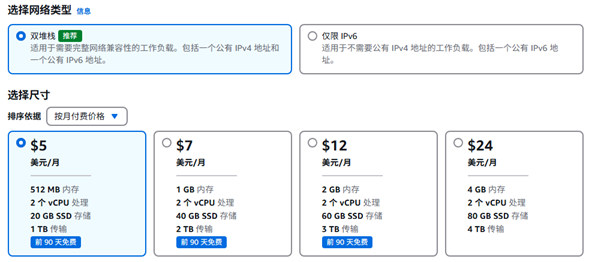

# 释放 VPS 的公网 IP，减少公有云花费

[English](./README.md)

## 背景

相信很多读者都有在公有云 VPS 上搭建自己专属应用的经历。如果我们想在本地访问公有云 VPS 上的服务，必须为该 VPS 分配公网 IP，特别是 IPv4 的应用，需要有公网 IPv4 地址。

[AWS Lightsail](https://aws.amazon.com/cn/lightsail/) 是一款性价比非常高的 VPS 产品，但是由于 AWS 对公网 IPv4 地址[收费政策的调整](https://aws.amazon.com/cn/blogs/aws/new-aws-public-ipv4-address-charge-public-ip-insights/)。AWS Lightsail 的费用出现了大幅上涨。

* 带有公网 IPv4 地址的 Lightsail 费用

 

* 不带公网 IPv4 地址的 Lightsail 费用


## 解决方案

借助 `wovenet` 我们可以摆脱对这个公网 IP 的依赖（公网 VPS 不需要在配置 IPv4 地址）。

**注意** 

* 不给 AWS Lightsail 配置公网 IPv4 地址不代表不能访问 IPv4 网络，AWS Lightsail 会为主机配置一个私有 IPv4 地址，通过 NAT 访问 IPv4 网络
* 虽然公有云 VPS 不需要在配置公网地址了，但是在客户端需要至少有一个公网 IPv4 或可以访问 IPv6 地址（如果你是家庭宽带，这两者都可以向运营商申请开启，在国内这是免费的；如果是教育网带宽，一般都能访问 IPv6 地址） 
* 本示例 `wovenet` 会建立的隧道有一个 IPv4 连接（AWS 连向本地），一个 IPv6 连接（本地连向 AWS），两个连接都是全双工的，它们组成了一个负载均衡（增强了网络的高可用性）


本文将以 `iperf` 应用为示例（`iperf` 是一款用于测试带宽的 Linux 工具），展示如何配置 `wovenet`，即使 VPS 没有公网 IPv4 地址，在本地也能正常访问公网 VPS 上的应用。

### 环境信息

| 主机位置 | IPv4 地址 | IPv6 地址 |
|---------|-----------|-----------|
| AWS     |  3.39.105.46 | 2406:da12:35a:3d02:1f43:11a1:abf2:2900 |
| 本地  | 36.106.107.114 | 240e:328:e10:e400:d620:ff:feb3:9915 |


**注意：** 

* AWS 的 IPv4 地址仅是为了做对比测试使用，正式配置 AWS 可以不要公网 IPv4 地址，在下面的 `wovenet` 配置文件中，这个公网 IP 也不会被使用


### AWS 主机配置

创建 `config.yaml` 文件，内容如下：

```yaml
siteName: aws

crypto:
  # 这个 key 是用来加密敏感信息的，要求每个 wovenet 实例都要配置相同的值。
  # 特别注意：不要使用本示例提供的值，否则可能造成敏感信息泄露。
  key: "aA6wBHTYd%#dOPr8"

logger:
  level: DEBUG
  file: ""
  format: json

messageChannel:
  protocol: mqtt
  mqtt:
    brokerServer: mqtt://mqtt.eclipseprojects.io:1883
    # 特别注意：强烈建议修改 topic，相同 topic 的 wovenet 实例会共同组成一个 mesh 网络。
    topic: "kungze/wovenet/dual-stack-ui78Tydwq"

# 如果你的本地网络不能访问 IPv6 地址，这儿就不需要配置了
tunnel:
  localSockets:
  # 公网 IPv6 地址是这个主机专属的，并且直接配置在主机网卡上，所以这儿使用了 dedicated-address 模式
  - mode: dedicated-address
    transportProtocol: quic
    publicAddress: 2406:da12:35a:3d02:1f43:11a1:abf2:2900
    publicPort: 25890

localExposedApps:
- appSocket: tcp:127.0.0.1:5201
  appName: iperf
```

**注意：** 

* 这里我们并没有使用公网 IPv4 地址。
* 需要在公有云防火墙/安全组中添加规则，放行 UDP 25890 端口。

执行下面命令启动 `wovenet`:

```
./wovenet run --config ./config.yaml
```

执行下面命令启动 `iperf` server:

```
$ iperf3 -s
-----------------------------------------------------------
Server listening on 5201 (test #1)
-----------------------------------------------------------
```

### 本地主机配置

创建 `config.yaml` 文件，内容如下：

```yaml
siteName: local

# 这个 key 是用来加密敏感信息的，要求每个 wovenet 实例都要配置相同的值。
# 特别注意：不要使用本示例提供的值，否则可能造成敏感信息泄露。
crypto:
  key: "aA6wBHTYd%#dOPr8"

logger:
  level: DEBUG
  file: ""
  format: json

messageChannel:
  protocol: mqtt
  mqtt:
    brokerServer: mqtt://mqtt.eclipseprojects.io:1883
    # 特别注意：强烈建议修改 topic，相同 topic 的 wovenet 实例会共同组件一个 mesh 网络，
    topic: "kungze/wovenet/dual-stack-ui78Tydwq"

# 如果你不能操纵你本地的公网 IP，这一段配置就不需要了（但是这需要要求你本地网络能访问 IPv6 地址）
tunnel:
  localSockets:
  # 在本地，公网 IPv4 地址通常会配置在 NAT 网关或者光猫上，需要你在 NAT 网关或者光猫上配置端口转发规则（把一个公网端口和本地端口做映射）
  # 使得通过公网能直接访问到 wovenet 实例。
  - mode: port-forwarding
    publicPort: 36092
    listenPort: 26098
    # 在有些场景，特别是家庭网络中，公网 IP 不是固定的，这里配置自动探测本地公网 IP，防止因公网 IP 变动导致 VPN 隧道不可用。
    publicAddress: autoHttpDetect
    httpDetector:
      url: https://ipinfo.io/ip
    transportProtocol: quic

remoteApps:
- siteName: aws
  appName: iperf
  localSocket: tcp:127.0.0.1:5201
```

**注意：**在本地，公网 IPv4 地址设置在 NAT 网关或光猫上，需要在NAT 网关/光猫上配置好端口映射规则。上面配置对应的端口映射规则：外部端口为 36092 内部端口为 26098，协议为 UDP。

执行下面命令启动 `wovenet`:

```
./wovenet run --config ./config.yaml
```

**特别注意：**

* 强烈建议修改 `crypto.Key` 和  `messageChannel.mqtt.topic`。并且不要在公网环境暴露这两个值。否则，可能被不怀好意的人利用，连接到你的 mesh 网络并发起恶意攻击。


### 验证结果

通过 iperf 命令验证 `wovenet` 是否生效，在测试过程中通过 iftop 命令观察网卡流量

#### 直接使用 AWS 公网 IPv4 地址测试

```
$ iperf3 -c 3.39.105.46 -P 10 -t 60
Connecting to host 3.39.105.46, port 5201
[  5] local 192.168.1.2 port 39652 connected to 3.39.105.46 port 5201
[  7] local 192.168.1.2 port 39662 connected to 3.39.105.46 port 5201
[  9] local 192.168.1.2 port 40948 connected to 3.39.105.46 port 5201
[ 11] local 192.168.1.2 port 40958 connected to 3.39.105.46 port 5201
[ 13] local 192.168.1.2 port 40974 connected to 3.39.105.46 port 5201
[ 15] local 192.168.1.2 port 40978 connected to 3.39.105.46 port 5201
[ 17] local 192.168.1.2 port 40986 connected to 3.39.105.46 port 5201
[ 19] local 192.168.1.2 port 40994 connected to 3.39.105.46 port 5201
[ 21] local 192.168.1.2 port 41008 connected to 3.39.105.46 port 5201
[ 23] local 192.168.1.2 port 41020 connected to 3.39.105.46 port 5201

......

[SUM]   0.00-60.01  sec   567 MBytes  79.2 Mbits/sec  21082             sender
[SUM]   0.00-60.09  sec   540 MBytes  75.4 Mbits/sec                  receiver
```


从上图我们看到，iperf 流量仅使用了 IPv4 地址。

#### 直接使用 AWS 公网 IPv6 地址测试

```
$ iperf3 -c 2406:da12:35a:3d02:1f43:11a1:abf2:2900 -P 10 -t 60
Connecting to host 2406:da12:35a:3d02:1f43:11a1:abf2:2900, port 5201
[  5] local 240e:328:e10:e400:d620:ff:feb3:9915 port 47640 connected to 2406:da12:35a:3d02:1f43:11a1:abf2:2900 port 5201
[  7] local 240e:328:e10:e400:d620:ff:feb3:9915 port 47648 connected to 2406:da12:35a:3d02:1f43:11a1:abf2:2900 port 5201
[  9] local 240e:328:e10:e400:d620:ff:feb3:9915 port 47656 connected to 2406:da12:35a:3d02:1f43:11a1:abf2:2900 port 5201
[ 11] local 240e:328:e10:e400:d620:ff:feb3:9915 port 47672 connected to 2406:da12:35a:3d02:1f43:11a1:abf2:2900 port 5201
[ 13] local 240e:328:e10:e400:d620:ff:feb3:9915 port 47684 connected to 2406:da12:35a:3d02:1f43:11a1:abf2:2900 port 5201
[ 15] local 240e:328:e10:e400:d620:ff:feb3:9915 port 47690 connected to 2406:da12:35a:3d02:1f43:11a1:abf2:2900 port 5201
[ 17] local 240e:328:e10:e400:d620:ff:feb3:9915 port 47696 connected to 2406:da12:35a:3d02:1f43:11a1:abf2:2900 port 5201
[ 19] local 240e:328:e10:e400:d620:ff:feb3:9915 port 47704 connected to 2406:da12:35a:3d02:1f43:11a1:abf2:2900 port 5201
[ 21] local 240e:328:e10:e400:d620:ff:feb3:9915 port 47714 connected to 2406:da12:35a:3d02:1f43:11a1:abf2:2900 port 5201
[ 23] local 240e:328:e10:e400:d620:ff:feb3:9915 port 47722 connected to 2406:da12:35a:3d02:1f43:11a1:abf2:2900 port 5201

......

[SUM]   0.00-60.01  sec   562 MBytes  78.6 Mbits/sec  23000             sender
[SUM]   0.00-60.10  sec   532 MBytes  74.3 Mbits/sec                  receiver
```


从上图我们看到，iperf 流量仅使用了 IPv6 地址。

#### 通过 `wovenet` 测试

```
$ iperf3 -c 127.0.0.1 -P 10 -t 60
Connecting to host 127.0.0.1, port 5201
[  5] local 127.0.0.1 port 34638 connected to 127.0.0.1 port 5201
[  7] local 127.0.0.1 port 34652 connected to 127.0.0.1 port 5201
[  9] local 127.0.0.1 port 34668 connected to 127.0.0.1 port 5201
[ 11] local 127.0.0.1 port 34674 connected to 127.0.0.1 port 5201
[ 13] local 127.0.0.1 port 34684 connected to 127.0.0.1 port 5201
[ 15] local 127.0.0.1 port 34690 connected to 127.0.0.1 port 5201
[ 17] local 127.0.0.1 port 34696 connected to 127.0.0.1 port 5201
[ 19] local 127.0.0.1 port 34702 connected to 127.0.0.1 port 5201
[ 21] local 127.0.0.1 port 34708 connected to 127.0.0.1 port 5201

......


[SUM]   0.00-60.00  sec   580 MBytes  81.1 Mbits/sec   79             sender
[SUM]   0.00-60.10  sec   534 MBytes  74.6 Mbits/sec                  receiver

iperf Done.
```


从上图我们看到，iperf 流量 **同时使用了 IPv4 和 IPv6 地址。** 从 iperf 的测试结果上看，`wovenet` 对带宽几乎没有影响，这是因为这两个测试机器地理位置不远，网络状况良好。参考另外一个示例[借助 wovenet 提升网络传输性能](../network-preformance/README_zh.md)可以看到 `wovenet` 在网络传输路径不是很健康的情况下的优异表现。
