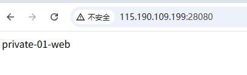

# Internal Network Penetration with wovenet

[简体中文](./README_zh.md)

This feature provides similar functionality to professional internal network penetration tools like [frp](https://github.com/fatedier/frp) and [ngrok](https://ngrok.com). 

## Environment Information

The system setup includes one public host (a virtual machine on a public cloud with a public IP bound via floating IP) and two private hosts located in different internal networks.

| Host Type | site name | public IP | private IP | private app port |
|---------|-----------|---------|---------|-------------|
| public Host | public | 115.190.109.199 | 192.168.0.2 | NONE |
| local Host | private-01 |       NONE    | 172.26.142.105 | 80 |
| local Host | private-02 |      NONE     | 192.168.1.2 | 22 |

Expected results of this setup:

* Expose a web service running on private-01 to the public internet for others to access.
* Enable public SSH access to a Linux host with IP 192.168.1.2 (private-02), making remote work more convenient.

### Public Host Configuration

Create a config file named `config.yaml` with the following content:

```yaml
siteName: public

logger:
  level: DEBUG
  file: ""
  format: json

messageChannel:
  protocol: mqtt
  cryptoKey: "7YUw12TYd%#dse45"
  mqtt:
    brokerServer: mqtt://mqtt.eclipseprojects.io:1883
    topic: "kungze/wovenet/reverse-proxy-78yted"

tunnel:
  localSockets:
  - mode: dedicated-address
    transportProtocol: quic
    publicAddress: 115.190.109.199
    publicPort: 25890
    listenPort: 25890

remoteApps:
- siteName: private-01
  remoteAppId: 25cad886-6edd-4ee8-a5dc-294b73649256
  localSocket: 0.0.0.0:28080
- siteName: private-02
  remoteAppId: 31f62ddd-397a-4047-9dc0-2c316708561c
  localSocket: 0.0.0.0:59822
```

### Private-01 Host Configuration

Create a config file named `config.yaml` with the following content:

```yaml
siteName: private-01

logger:
  level: DEBUG
  file: ""
  format: json

messageChannel:
  protocol: mqtt
  cryptoKey: "7YUw12TYd%#dse45"
  mqtt:
    brokerServer: mqtt://mqtt.eclipseprojects.io:1883
    topic: "kungze/wovenet/reverse-proxy-78yted"

localExposedApps:
- socket: 172.26.142.105:80
  id: 25cad886-6edd-4ee8-a5dc-294b73649256
```

### Private-02 Host Configuration

Create a config file named `config.yaml` with the following content:

```yaml
siteName: private-02

logger:
  level: DEBUG
  file: ""
  format: json

messageChannel:
  protocol: mqtt
  cryptoKey: "7YUw12TYd%#dse45"
  mqtt:
    brokerServer: mqtt://mqtt.eclipseprojects.io:1883
    topic: "kungze/wovenet/reverse-proxy-78yted"

localExposedApps:
- socket: 192.168.1.2:22
  id: 31f62ddd-397a-4047-9dc0-2c316708561c
```

Run the following command on all three hosts (execution order doesn't matter):

```bash
./wovenet run --config ./config.yaml
```

**Important Notes:**

* It is strongly recommended to modify `messageChannel.cryptoKey` and `messageChannel.mqtt.topic`, and never expose these values in a public environment. If exposed, malicious users might connect to your site network and potentially launch attacks.

* The following ports on the public host must be open in your security group or firewall

  * UDP: 25890
  * TCP: 28080
  * TCP: 59822

###

* Open a browser and visit: http://115.190.109.199:28080/, You should see an output like the image below (actual output depends on your web service):



* Open a terminal and SSH into 115.190.109.199:59822 to log into the internal host `private-02`

```base
> ssh ubuntu@115.190.109.199 -p 59822
Welcome to Ubuntu 24.04.2 LTS (GNU/Linux 6.8.0-57-generic x86_64)

 * Documentation:  https://help.ubuntu.com
 * Management:     https://landscape.canonical.com
 * Support:        https://ubuntu.com/pro

 System information as of Fri Apr 18 03:59:04 PM CST 2025

  System load:             0.01
  Usage of /:              24.6% of 29.18GB
  Memory usage:            7%
  Swap usage:              0%
  Temperature:             40.0 C
  Processes:               118
  Users logged in:         1
  IPv4 address for enp3s0: 192.168.1.2

 * Strictly confined Kubernetes makes edge and IoT secure. Learn how MicroK8s
   just raised the bar for easy, resilient and secure K8s cluster deployment.

   https://ubuntu.com/engage/secure-kubernetes-at-the-edge

Expanded Security Maintenance for Applications is not enabled.

18 updates can be applied immediately.
To see these additional updates run: apt list --upgradable

Enable ESM Apps to receive additional future security updates.
See https://ubuntu.com/esm or run: sudo pro status


Last login: Fri Apr 18 15:37:01 2025 from 221.238.158.60
ubuntu@ubuntu:~$ ip a
1: lo: <LOOPBACK,UP,LOWER_UP> mtu 65536 qdisc noqueue state UNKNOWN group default qlen 1000
    link/loopback 00:00:00:00:00:00 brd 00:00:00:00:00:00
    inet 127.0.0.1/8 scope host lo
       valid_lft forever preferred_lft forever
    inet6 ::1/128 scope host noprefixroute
       valid_lft forever preferred_lft forever
2: enp3s0: <BROADCAST,MULTICAST,UP,LOWER_UP> mtu 1500 qdisc fq_codel state UP group default qlen 1000
    link/ether d4:20:00:b3:99:15 brd ff:ff:ff:ff:ff:ff
    inet 192.168.1.2/24 brd 192.168.1.255 scope global enp3s0
       valid_lft forever preferred_lft forever
    inet6 fe80::d620:ff:feb3:9915/64 scope link
       valid_lft forever preferred_lft forever
3: enp4s0: <NO-CARRIER,BROADCAST,MULTICAST,UP> mtu 1500 qdisc fq_codel state DOWN group default qlen 1000
    link/ether d4:20:00:b3:99:16 brd ff:ff:ff:ff:ff:ff
```