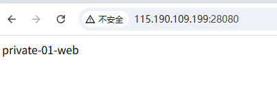

# 借助 wovenet 实现内网穿透

[English](./README.md)

这个功能与 [frp](https://github.com/fatedier/frp)，[ngrok](https://ngrok.com) 等专业内网穿透软件提供的功能相同。

## 环境信息

在整个系统中包含一个公网主机（在公有云上的一个虚机，通过浮动 IP 的方式绑定了一个公网 IP），两个内网主机（分别位于不同的内网环境）。

| 主机类型 | site name |公网 IP | 内网 IP | 内网 app 端口 |
|---------|-----------|---------|---------|-------------|
| 公网主机 | public | 115.190.109.199 | 192.168.0.2 | 无 |
| 内网主机 | private-01 |       无       | 172.26.142.105 | 80 |
| 内网主机 | private-02 |      无     | 192.168.1.2 | 22 |

本示例达成效果：

* 在公网上暴露 private-01 上的一个 web 服务，以便其他人能访问
* 使 private-02 站点内一个 IP 为 192.168.1.2 linux 主机能在公网被 ssh 访问，方便远程办公

### 公网主机配置：

创建配置文件 `config.yaml`，内容如下：

```yaml
siteName: public

crypto:
  key: "7YUw12TYd%#dse45"

logger:
  level: DEBUG
  file: ""
  format: json

messageChannel:
  protocol: mqtt
  mqtt:
    brokerServer: mqtt://mqtt.eclipseprojects.io:1883
    topic: "kungze/wovenet/reverse-proxy-78yted"

tunnel:
  localSockets:
  - mode: dedicated-address
    transportProtocol: quic
    publicAddress: 115.190.109.199
    publicPort: 25890
    listenPort: 25890

remoteApps:
- siteName: private-01
  appName: web
  localSocket: tcp:0.0.0.0:28080
- siteName: private-02
  appName: ssh
  localSocket: tcp:0.0.0.0:59822
```

### 内网主机 1 配置：

创建配置文件 `config.yaml`，内容如下：

```yaml
siteName: private-01

crypto:
  key: "7YUw12TYd%#dse45"

logger:
  level: DEBUG
  file: ""
  format: json

messageChannel:
  protocol: mqtt
  mqtt:
    brokerServer: mqtt://mqtt.eclipseprojects.io:1883
    topic: "kungze/wovenet/reverse-proxy-78yted"

localExposedApps:
- appSocket: tcp:172.26.142.105:80
  appName: web
```

### 内网主机 2 配置：

创建配置文件 `config.yaml`，内容如下：

```yaml
siteName: private-02

crypto:
  key: "7YUw12TYd%#dse45"

logger:
  level: DEBUG
  file: ""
  format: json

messageChannel:
  protocol: mqtt
  mqtt:
    brokerServer: mqtt://mqtt.eclipseprojects.io:1883
    topic: "kungze/wovenet/reverse-proxy-78yted"

localExposedApps:
- appSocket: tcp:192.168.1.2:22
  appName: ssh
```

在三个主机上分别执行命令（三个主机可以任意顺序执行）：

```
./wovenet run --config ./config.yaml
```

**特别注意：**

* 强烈建议修改 `crypto.Key` 和  `messageChannel.mqtt.topic`。并且不要在公网环境暴露这两个值。如果暴露，可能会被不怀好意的人利用，连接到你的站点网络，可能会发起恶意攻击。

* 上面配置中，需要用到公网主机的 UDP 25890 端口，TCP 28080 端口，TCP 59822 端口，需要在安全组，或者防火墙配置规则，放行这几个端口。

### 验证

* 打开浏览器访问连接：http://115.190.109.199:28080/ ，可以得到下面输出（实际输出内容由你自己的 web 服务决定）：



* 打开一个终端，通过 ssh 访问 115.190.109.199:59822，登录 private-02 内网主机。

```base
> ssh ubuntu@115.190.109.199 -p 59822
Welcome to Ubuntu 24.04.2 LTS (GNU/Linux 6.8.0-57-generic x86_64)

 * Documentation:  https://help.ubuntu.com
 * Management:     https://landscape.canonical.com
 * Support:        https://ubuntu.com/pro

 System information as of Fri Apr 18 03:59:04 PM CST 2025

  System load:             0.01
  Usage of /:              24.6% of 29.18GB
  Memory usage:            7%
  Swap usage:              0%
  Temperature:             40.0 C
  Processes:               118
  Users logged in:         1
  IPv4 address for enp3s0: 192.168.1.2

 * Strictly confined Kubernetes makes edge and IoT secure. Learn how MicroK8s
   just raised the bar for easy, resilient and secure K8s cluster deployment.

   https://ubuntu.com/engage/secure-kubernetes-at-the-edge

Expanded Security Maintenance for Applications is not enabled.

18 updates can be applied immediately.
To see these additional updates run: apt list --upgradable

Enable ESM Apps to receive additional future security updates.
See https://ubuntu.com/esm or run: sudo pro status


Last login: Fri Apr 18 15:37:01 2025 from 221.238.158.60
ubuntu@ubuntu:~$ ip a
1: lo: <LOOPBACK,UP,LOWER_UP> mtu 65536 qdisc noqueue state UNKNOWN group default qlen 1000
    link/loopback 00:00:00:00:00:00 brd 00:00:00:00:00:00
    inet 127.0.0.1/8 scope host lo
       valid_lft forever preferred_lft forever
    inet6 ::1/128 scope host noprefixroute
       valid_lft forever preferred_lft forever
2: enp3s0: <BROADCAST,MULTICAST,UP,LOWER_UP> mtu 1500 qdisc fq_codel state UP group default qlen 1000
    link/ether d4:20:00:b3:99:15 brd ff:ff:ff:ff:ff:ff
    inet 192.168.1.2/24 brd 192.168.1.255 scope global enp3s0
       valid_lft forever preferred_lft forever
    inet6 fe80::d620:ff:feb3:9915/64 scope link
       valid_lft forever preferred_lft forever
3: enp4s0: <NO-CARRIER,BROADCAST,MULTICAST,UP> mtu 1500 qdisc fq_codel state DOWN group default qlen 1000
    link/ether d4:20:00:b3:99:16 brd ff:ff:ff:ff:ff:ff
```
