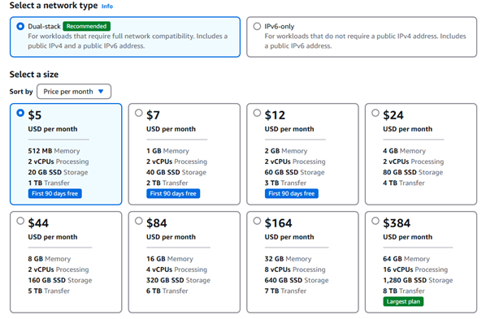
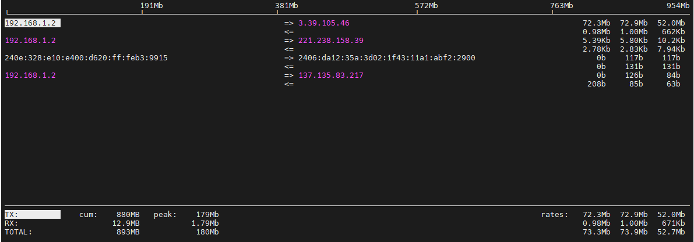
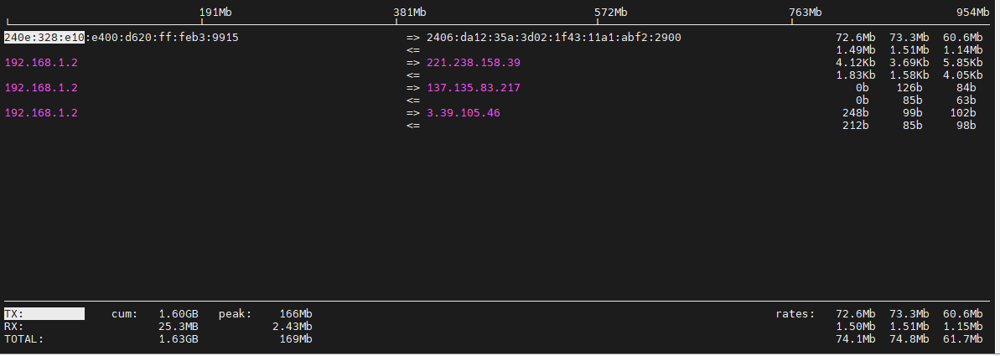

# Dual-Stack Configuration with IPv4 and IPv6 to Enhance Stability and Cut Costs

[简体中文](./README_zh.md)

## Background

[AWS Lightsail](https://aws.amazon.com/lightsail/) is a very cost-effective VPS product. However, due to the new [pricing policy for public IPv4 addresses](https://aws.amazon.com/cn/blogs/aws/new-aws-public-ipv4-address-charge-public-ip-insights/), the cost of using Lightsail has significantly increased.

* Lightsail with public IPv4 address

 

* Lightsail without public IPv4 address


## Solution

To reduce costs, we naturally choose the plan **without** a public IPv4 address. This article uses iperf as an example application to show how to configure `wovenet`, allowing our application to function properly even without a public IPv4 address.

**PS:**

* Not assigning a public IPv4 address to an AWS Lightsail instance doesn’t mean it can’t access the IPv4 network. Lightsail will assign a private IPv4 address, which can access the IPv4 internet via NAT.
* `iperf` is a Linux tool used to test bandwidth. Using it as a sample application also allows us to evaluate `wovenet`’s impact on bandwidth.
* This example `wovenet` will establishes a tunnel with one IPv4 connection (from AWS to the local site) and one IPv6 connection (from the local site to AWS). The two connections are load-balanced to enhance network high availability.

### Environment Info

| Host Location | Public IPv4 Address | Public IPv6 Address |
|---------|-----------|-----------|
| AWS     |  3.39.105.46 | 2406:da12:35a:3d02:1f43:11a1:abf2:2900 |
| 本地  | 36.106.107.114 | 240e:328:e10:e400:d620:ff:feb3:9915 |


**Note:**

* The AWS public IPv4 address is only used for comparison testing. In production, the AWS instance doesn’t need a public IPv4 address.
* The local machine **must have** a public IPv4 or IPv6 address (for home broadband, you can request a public IP from your ISP).

  **PS:**

  * Residential IPv4 addresses may change periodically (`wovenet` will support dynamic IP detection in the near future to address this).
  * Once `wovenet` supports NAT traversal, the local machine won't need a public IP anymore.

### AWS Host Configuration

Create a `config.yaml` file with the following content:

```yaml
siteName: aws

logger:
  level: DEBUG
  file: ""
  format: json

messageChannel:
  protocol: mqtt
  cryptoKey: "aA6wBHTYd%#dOPr8"
  mqtt:
    brokerServer: mqtt://mqtt.eclipseprojects.io:1883
    topic: "kungze/wovenet/dual-stack-ui78Tydwq"

tunnel:
  localSockets:
  - mode: dedicated-address
    transportProtocol: quic
    publicAddress: 2406:da12:35a:3d02:1f43:11a1:abf2:2900
    publicPort: 25890

localExposedApps:
- socket: 127.0.0.1:5201
  id: afe87405-0f46-4290-84df-b6034b54761f
```

**Note:**

We’re not using the AWS public IPv4 address in the above config. The IPv6 address is assigned directly to the network interface. Be sure to add a security group/firewall rule to allow UDP traffic on port 25890.

Start `wovenet` with:

```
./wovenet run --config ./config.yaml
```

Start the iperf server with:

```
iperf3 -s
-----------------------------------------------------------
Server listening on 5201 (test #1)
-----------------------------------------------------------
```

### Local Host Configuration

Create a `config.yaml` file with the following content:

```yaml
siteName: local

logger:
  level: DEBUG
  file: ""
  format: json

messageChannel:
  protocol: mqtt
  cryptoKey: "aA6wBHTYd%#dOPr8"
  mqtt:
    brokerServer: mqtt://mqtt.eclipseprojects.io:1883
    topic: "kungze/wovenet/dual-stack-ui78Tydwq"

tunnel:
  localSockets:
  - mode: port-forwarding
    transportProtocol: quic
    publicAddress: 36.106.107.114
    publicPort: 36092
    listenPort: 26098

remoteApps:
- siteName: aws
  remoteAppId: afe87405-0f46-4290-84df-b6034b54761f
  localSocket: 127.0.0.1:5201
```

**Note:**

On the local side, the public IPv4 address is set on the NAT gateway or modem/router. You’ll need to set up port forwarding (external port: 36092, internal port: 26098, protocol: UDP).

Start `wovenet` with:

```
./wovenet run --config ./config.yaml
```

**Important Notes:**

* It is strongly recommended to modify `messageChannel.cryptoKey` and `messageChannel.mqtt.topic`, and never expose these values in a public environment. If exposed, malicious users might connect to your site network and potentially launch attacks.

### Validation Results

Verify that `wovenet` is functioning using iperf, and observe network interface traffic using `iftop`.

* Test with AWS public IPv4 address:

```
$ iperf3 -c 3.39.105.46 -P 10 -t 60
Connecting to host 3.39.105.46, port 5201
[  5] local 192.168.1.2 port 39652 connected to 3.39.105.46 port 5201
[  7] local 192.168.1.2 port 39662 connected to 3.39.105.46 port 5201
[  9] local 192.168.1.2 port 40948 connected to 3.39.105.46 port 5201
[ 11] local 192.168.1.2 port 40958 connected to 3.39.105.46 port 5201
[ 13] local 192.168.1.2 port 40974 connected to 3.39.105.46 port 5201
[ 15] local 192.168.1.2 port 40978 connected to 3.39.105.46 port 5201
[ 17] local 192.168.1.2 port 40986 connected to 3.39.105.46 port 5201
[ 19] local 192.168.1.2 port 40994 connected to 3.39.105.46 port 5201
[ 21] local 192.168.1.2 port 41008 connected to 3.39.105.46 port 5201
[ 23] local 192.168.1.2 port 41020 connected to 3.39.105.46 port 5201

......

[SUM]   0.00-60.01  sec   567 MBytes  79.2 Mbits/sec  21082             sender
[SUM]   0.00-60.09  sec   540 MBytes  75.4 Mbits/sec                  receiver
```



As shown above, traffic only used the IPv4 address.

* Test with AWS public IPv6 address:

```
$ iperf3 -c 2406:da12:35a:3d02:1f43:11a1:abf2:2900 -P 10 -t 60
Connecting to host 2406:da12:35a:3d02:1f43:11a1:abf2:2900, port 5201
[  5] local 240e:328:e10:e400:d620:ff:feb3:9915 port 47640 connected to 2406:da12:35a:3d02:1f43:11a1:abf2:2900 port 5201
[  7] local 240e:328:e10:e400:d620:ff:feb3:9915 port 47648 connected to 2406:da12:35a:3d02:1f43:11a1:abf2:2900 port 5201
[  9] local 240e:328:e10:e400:d620:ff:feb3:9915 port 47656 connected to 2406:da12:35a:3d02:1f43:11a1:abf2:2900 port 5201
[ 11] local 240e:328:e10:e400:d620:ff:feb3:9915 port 47672 connected to 2406:da12:35a:3d02:1f43:11a1:abf2:2900 port 5201
[ 13] local 240e:328:e10:e400:d620:ff:feb3:9915 port 47684 connected to 2406:da12:35a:3d02:1f43:11a1:abf2:2900 port 5201
[ 15] local 240e:328:e10:e400:d620:ff:feb3:9915 port 47690 connected to 2406:da12:35a:3d02:1f43:11a1:abf2:2900 port 5201
[ 17] local 240e:328:e10:e400:d620:ff:feb3:9915 port 47696 connected to 2406:da12:35a:3d02:1f43:11a1:abf2:2900 port 5201
[ 19] local 240e:328:e10:e400:d620:ff:feb3:9915 port 47704 connected to 2406:da12:35a:3d02:1f43:11a1:abf2:2900 port 5201
[ 21] local 240e:328:e10:e400:d620:ff:feb3:9915 port 47714 connected to 2406:da12:35a:3d02:1f43:11a1:abf2:2900 port 5201
[ 23] local 240e:328:e10:e400:d620:ff:feb3:9915 port 47722 connected to 2406:da12:35a:3d02:1f43:11a1:abf2:2900 port 5201

......

[SUM]   0.00-60.01  sec   562 MBytes  78.6 Mbits/sec  23000             sender
[SUM]   0.00-60.10  sec   532 MBytes  74.3 Mbits/sec                  receiver
```



As shown above, traffic only used the IPv6 address.

* Test through `wovenet`:

```
$ iperf3 -c 127.0.0.1 -P 10 -t 60
Connecting to host 127.0.0.1, port 5201
[  5] local 127.0.0.1 port 34638 connected to 127.0.0.1 port 5201
[  7] local 127.0.0.1 port 34652 connected to 127.0.0.1 port 5201
[  9] local 127.0.0.1 port 34668 connected to 127.0.0.1 port 5201
[ 11] local 127.0.0.1 port 34674 connected to 127.0.0.1 port 5201
[ 13] local 127.0.0.1 port 34684 connected to 127.0.0.1 port 5201
[ 15] local 127.0.0.1 port 34690 connected to 127.0.0.1 port 5201
[ 17] local 127.0.0.1 port 34696 connected to 127.0.0.1 port 5201
[ 19] local 127.0.0.1 port 34702 connected to 127.0.0.1 port 5201
[ 21] local 127.0.0.1 port 34708 connected to 127.0.0.1 port 5201

......


[SUM]   0.00-60.00  sec   580 MBytes  81.1 Mbits/sec   79             sender
[SUM]   0.00-60.10  sec   534 MBytes  74.6 Mbits/sec                  receiver

iperf Done.
```


As shown above, traffic used both IPv4 and IPv6 addresses simultaneously.
