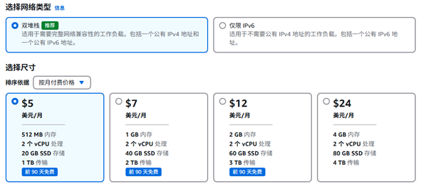
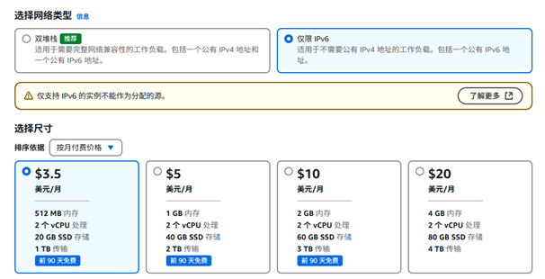
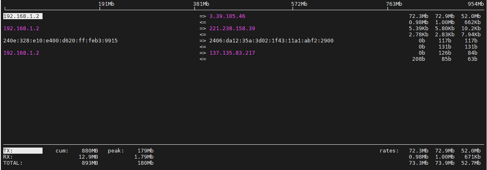
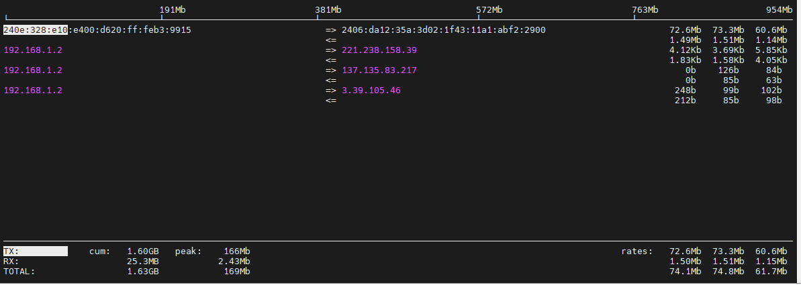
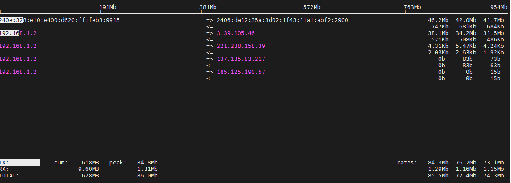

# IPv4 与 IPv6 双栈配置，增强网络稳定性，减少费用

[English](./README.md)

## 背景

[AWS Lightsail](https://aws.amazon.com/cn/lightsail/) 是一款性价比非常高的 VPS 产品，但是由于 AWS 公网 IPv4 地址[收费政策的调整](https://aws.amazon.com/cn/blogs/aws/new-aws-public-ipv4-address-charge-public-ip-insights/)。AWS Lightsail 的费用出现了大幅上涨。

* 带有公网 IPv4 地址的 Lightsail 费用

 

* 不带公网 IPv4 地址的 Lightsail 费用



## 解决方案

为了减少费用，我们当然选择不带 IPv4 公网地址的方案。本文将以 iperf 应用为示例，展示如何配置 `wovenet`，即使没有公网 IPv4 地址，也能让应用正常运行。

**PS:** 

* 不给 AWS Lightsail 配置公网 IPv4 地址不代表不能访问 IPv4 网络，AWS Lightsail 会为主机配置一个私有 IPv4 地址，通过 NAT 访问 IPv4 网络
* iperf 是一个 Linux 工具，用于测试带宽。使用 iperf 作为示例应用的同时，我们还能顺便比较 `wovenet` 对带宽的影响。
* 本示例 `wovenet` 会建立的隧道有一个 IPv4 连接（AWS 连向本地），一个 IPv6 连接（本地连向 AWS）,两个连接做负载均衡（增强了网络的高可用性）

### 环境信息

| 主机位置 | IPv4 地址 | IPv6 地址 |
|---------|-----------|-----------|
| AWS     |  3.39.105.46 | 2406:da12:35a:3d02:1f43:11a1:abf2:2900 |
| 本地  | 36.106.107.114 | 240e:328:e10:e400:d620:ff:feb3:9915 |


**注意：** 

* AWS 的 IPv4 地址仅是为了做对比测试使用，正式配置 AWS 可以不要公网 IPv4 地址。
* 本地至少需要具备一个公网 IPv4 地址或 IPv6 地址（如果你使用的是家庭带宽，可以向运营商申请开启公网 IP）

  **PS:** 
  
  * 家庭宽带  IPv4 的地址可能会定期变动（不久的将来 `wovenet` 会支持动态公网 IP 检测的功能来解决这个问题）
  * 在将来 `wovenet` 实现 nat 打洞后，本地可以不需要公网 IP 地址

### AWS 主机配置

创建 `config.yaml` 文件，内容如下：

```yaml
siteName: aws

logger:
  level: DEBUG
  file: ""
  format: json

messageChannel:
  protocol: mqtt
  cryptoKey: "aA6wBHTYd%#dOPr8"
  mqtt:
    brokerServer: mqtt://mqtt.eclipseprojects.io:1883
    topic: "kungze/wovenet/dual-stack-ui78Tydwq"

tunnel:
  localSockets:
  - mode: dedicated-address
    transportProtocol: quic
    publicAddress: 2406:da12:35a:3d02:1f43:11a1:abf2:2900
    publicPort: 25890

localExposedApps:
- appSocket: tcp:127.0.0.1:5201
  appName: iperf
```

**注意：** 上面配置我们没有使用到 AWS 主机的公网 IPv4 地址，公网 IPv6 地址是这个主机专属的，并且直接配置在主机网卡上。需要在防火墙/安全组添加规则，放行 UDP 25890 端口。

执行下面命令启动 `wovenet`:

```
./wovenet run --config ./config.yaml
```

执行下面命令启动 iperf server:

```
$ iperf3 -s
-----------------------------------------------------------
Server listening on 5201 (test #1)
-----------------------------------------------------------
```

### 本地主机配置

创建 `config.yaml` 文件，内容如下：

```yaml
siteName: local

logger:
  level: DEBUG
  file: ""
  format: json

messageChannel:
  protocol: mqtt
  cryptoKey: "aA6wBHTYd%#dOPr8"
  mqtt:
    brokerServer: mqtt://mqtt.eclipseprojects.io:1883
    topic: "kungze/wovenet/dual-stack-ui78Tydwq"

tunnel:
  localSockets:
  - mode: port-forwarding
    transportProtocol: quic
    publicAddress: 36.106.107.114
    publicPort: 36092
    listenPort: 26098

remoteApps:
- siteName: aws
  appName: iperf
  localSocket: tcp:127.0.0.1:5201
```

**注意：**在本地，公网 IPv4 地址设置在 NAT 网关/光猫上，需要在NAT 网关/光猫上配置好端口映射规则。上面配置对应的端口映射规则：外部端口为 36092 内部端口为 26098，协议为 UDP。

执行下面命令启动 `wovenet`:

```
./wovenet run --config ./config.yaml
```

**特别注意：**

* 强烈建议修改 `messageChannel.cryptoKey` 和  `messageChannel.mqtt.topic`。并且不要在公网环境暴露这两个值。如果暴露，可能会被不怀好意的人利用，连接到你的站点网络，可能会发起恶意攻击。


### 验证结果

通过 iperf 命令验证 `wovenet` 是否生效，在测试过程中通过 iftop 命令观察网卡流量

* AWS 公网 IPv4 地址测试

```
$ iperf3 -c 3.39.105.46 -P 10 -t 60
Connecting to host 3.39.105.46, port 5201
[  5] local 192.168.1.2 port 39652 connected to 3.39.105.46 port 5201
[  7] local 192.168.1.2 port 39662 connected to 3.39.105.46 port 5201
[  9] local 192.168.1.2 port 40948 connected to 3.39.105.46 port 5201
[ 11] local 192.168.1.2 port 40958 connected to 3.39.105.46 port 5201
[ 13] local 192.168.1.2 port 40974 connected to 3.39.105.46 port 5201
[ 15] local 192.168.1.2 port 40978 connected to 3.39.105.46 port 5201
[ 17] local 192.168.1.2 port 40986 connected to 3.39.105.46 port 5201
[ 19] local 192.168.1.2 port 40994 connected to 3.39.105.46 port 5201
[ 21] local 192.168.1.2 port 41008 connected to 3.39.105.46 port 5201
[ 23] local 192.168.1.2 port 41020 connected to 3.39.105.46 port 5201

......

[SUM]   0.00-60.01  sec   567 MBytes  79.2 Mbits/sec  21082             sender
[SUM]   0.00-60.09  sec   540 MBytes  75.4 Mbits/sec                  receiver
```



从上图我们看到，iperf 流量仅使用了 IPv4 地址。

* AWS 公网 IPv6 地址测试

```
$ iperf3 -c 2406:da12:35a:3d02:1f43:11a1:abf2:2900 -P 10 -t 60
Connecting to host 2406:da12:35a:3d02:1f43:11a1:abf2:2900, port 5201
[  5] local 240e:328:e10:e400:d620:ff:feb3:9915 port 47640 connected to 2406:da12:35a:3d02:1f43:11a1:abf2:2900 port 5201
[  7] local 240e:328:e10:e400:d620:ff:feb3:9915 port 47648 connected to 2406:da12:35a:3d02:1f43:11a1:abf2:2900 port 5201
[  9] local 240e:328:e10:e400:d620:ff:feb3:9915 port 47656 connected to 2406:da12:35a:3d02:1f43:11a1:abf2:2900 port 5201
[ 11] local 240e:328:e10:e400:d620:ff:feb3:9915 port 47672 connected to 2406:da12:35a:3d02:1f43:11a1:abf2:2900 port 5201
[ 13] local 240e:328:e10:e400:d620:ff:feb3:9915 port 47684 connected to 2406:da12:35a:3d02:1f43:11a1:abf2:2900 port 5201
[ 15] local 240e:328:e10:e400:d620:ff:feb3:9915 port 47690 connected to 2406:da12:35a:3d02:1f43:11a1:abf2:2900 port 5201
[ 17] local 240e:328:e10:e400:d620:ff:feb3:9915 port 47696 connected to 2406:da12:35a:3d02:1f43:11a1:abf2:2900 port 5201
[ 19] local 240e:328:e10:e400:d620:ff:feb3:9915 port 47704 connected to 2406:da12:35a:3d02:1f43:11a1:abf2:2900 port 5201
[ 21] local 240e:328:e10:e400:d620:ff:feb3:9915 port 47714 connected to 2406:da12:35a:3d02:1f43:11a1:abf2:2900 port 5201
[ 23] local 240e:328:e10:e400:d620:ff:feb3:9915 port 47722 connected to 2406:da12:35a:3d02:1f43:11a1:abf2:2900 port 5201

......

[SUM]   0.00-60.01  sec   562 MBytes  78.6 Mbits/sec  23000             sender
[SUM]   0.00-60.10  sec   532 MBytes  74.3 Mbits/sec                  receiver
```



从上图我们看到，iperf 流量仅使用了 IPv6 地址。

* 通过 `wovenet` 测试

```
$ iperf3 -c 127.0.0.1 -P 10 -t 60
Connecting to host 127.0.0.1, port 5201
[  5] local 127.0.0.1 port 34638 connected to 127.0.0.1 port 5201
[  7] local 127.0.0.1 port 34652 connected to 127.0.0.1 port 5201
[  9] local 127.0.0.1 port 34668 connected to 127.0.0.1 port 5201
[ 11] local 127.0.0.1 port 34674 connected to 127.0.0.1 port 5201
[ 13] local 127.0.0.1 port 34684 connected to 127.0.0.1 port 5201
[ 15] local 127.0.0.1 port 34690 connected to 127.0.0.1 port 5201
[ 17] local 127.0.0.1 port 34696 connected to 127.0.0.1 port 5201
[ 19] local 127.0.0.1 port 34702 connected to 127.0.0.1 port 5201
[ 21] local 127.0.0.1 port 34708 connected to 127.0.0.1 port 5201

......


[SUM]   0.00-60.00  sec   580 MBytes  81.1 Mbits/sec   79             sender
[SUM]   0.00-60.10  sec   534 MBytes  74.6 Mbits/sec                  receiver

iperf Done.
```



从上图我们看到，iperf 流量同时使用了 IPv4 和 IPv6 地址。
